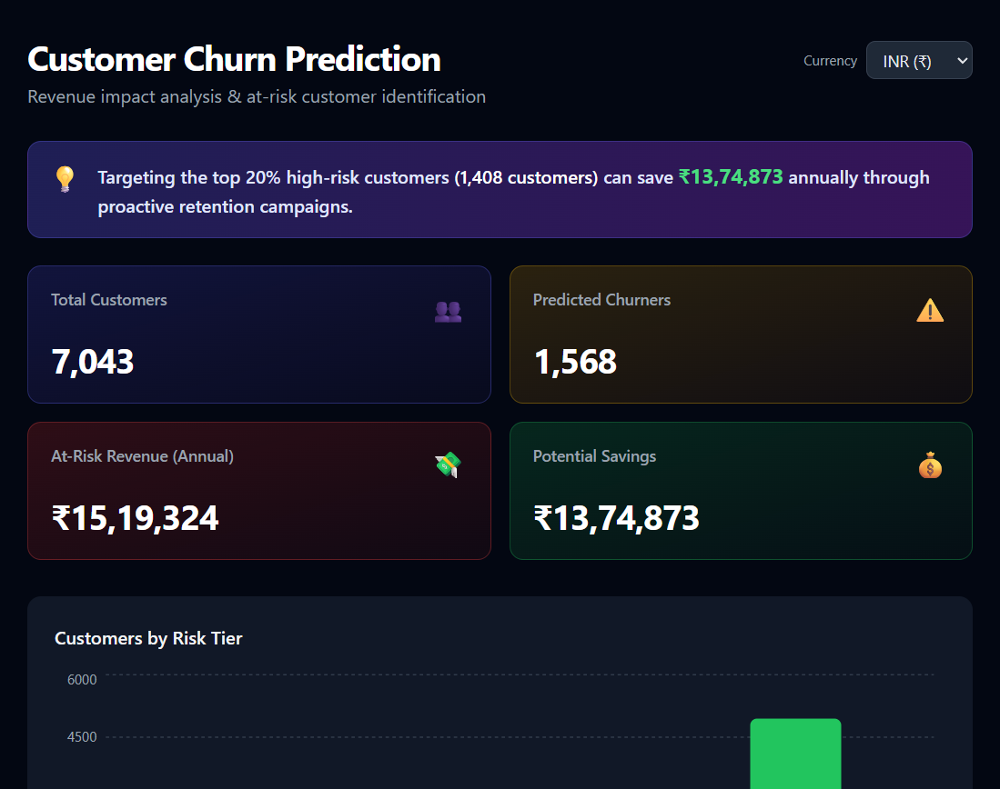

# Customer Churn Prediction + Revenue Impact Dashboard

> End-to-end ML web app that predicts telecom customer churn and quantifies the annual revenue at stake — with multi-currency support.

[](https://www.python.org/)
[](https://react.dev/)
[](./LICENSE)

---

## Live Demo

|          | Link                                                                                                                           |
| -------- | ------------------------------------------------------------------------------------------------------------------------------ |
| Frontend | [customer-churn-revenue-intelligence.vercel.app](https://customer-churn-revenue-intelligence.vercel.app)                       |
| Source   | [github.com/sumeet7878/customer-churn-revenue-intelligence](https://github.com/sumeet7878/customer-churn-revenue-intelligence) |



---

## Problem Statement

Telecom companies lose **15–25% of their customer base annually to churn**, translating to millions in lost recurring revenue. Identifying at-risk customers before they leave is critical — reactive win-back campaigns cost 5× more than proactive retention.

---

## Business Impact

> **The model identifies the top 20% highest-risk customers. Targeting this cohort with proactive retention campaigns can save ₹13,74,873 annually — without spending budget on the 80% unlikely to churn.**

The dashboard surfaces:

- **At-risk annual revenue** broken down across High / Medium / Low risk segments
- **Top 20 individual customers** ranked by churn probability with sortable revenue impact
- **Live currency toggle** (INR · USD · AED · GBP · EUR) for global stakeholders — no API calls, instant conversion

---

## Key Insight

**Month-to-month contract customers churn at 42.7% vs 11.3% for annual contracts (3.8× higher risk)** — making contract type the single strongest retention lever available to the business.

---

## Architecture

Predictions are **pre-computed once** using the trained ML model and saved as `results.json`, which is bundled with the React frontend at build time. This means:

- **Instant load** — no cold-start delay, no backend to maintain
- **Zero hosting cost** — deploys entirely on Vercel's free tier
- **Deliberate tradeoff** — a live FastAPI backend (`backend/`) is included in the repo and can be wired up in production for real-time scoring on fresh customer data

---

## Tech Stack

| Layer      | Technology                                        |
| ---------- | ------------------------------------------------- |
| ML         | Python · scikit-learn · pandas (LR vs RF, best by ROC-AUC) |
| Frontend   | React 18 · Vite · Tailwind CSS · Recharts         |
| Deployment | Vercel (static, free)                             |

---

## How It Works

- **Train once** — Logistic Regression and Random Forest are both trained on the [IBM Telco Churn dataset](https://github.com/IBM/telco-customer-churn-on-icp4d); the winner by ROC-AUC is persisted as `model.pkl`.
- **Pre-compute** — `generate_predictions.py` scores all 7,000+ customers and writes KPIs, risk tiers, and the top-50 table to `frontend/src/data/results.json`.
- **Serve statically** — the React app imports `results.json` at build time; no runtime API calls.
- **Currency toggle** — all monetary KPIs convert instantly across 5 currencies using fixed rates.

---

## Model Performance

| Model               | ROC-AUC |
| ------------------- | ------- |
| Logistic Regression | ~0.85   |
| Random Forest       | ~0.83   |

Winner is selected automatically at training time. LR typically edges out RF on this dataset.

---

## Setup

### 1. Generate prediction data (run once)

```bash
pip install -r backend/requirements.txt
python generate_predictions.py
```

Downloads the dataset (~1 MB), trains both models, picks the winner, and writes `frontend/src/data/results.json`. Re-run whenever you want to refresh predictions.

### 2. Run the frontend locally

```bash
cd frontend
npm install
npm run dev        # http://localhost:5173
```

No backend server needed — the app reads `results.json` at build time.

---

## Deploy to Vercel

1. Push repo to GitHub.
2. [vercel.com](https://vercel.com) → **New Project** → import this repo.
3. **Framework Preset** → `Other` · **Root Directory** → `/` (leave blank).
4. No environment variables needed.
5. Click **Deploy**.

`vercel.json` at the repo root handles the build command and output directory automatically.

---

## Refreshing Predictions

```bash
python generate_predictions.py
git add frontend/src/data/results.json
git commit -m "chore: refresh prediction data"
git push
```

Vercel auto-deploys on every push.

---

## Backend (reference)

The `backend/` folder contains a fully working FastAPI server that serves the same data live. It is **not** used in the Vercel deployment but can be deployed to any Python host (e.g. Render) for real-time scoring.

| File                       | Purpose                                                      |
| -------------------------- | ------------------------------------------------------------ |
| `backend/train.py`         | ML pipeline — downloads data, trains LR + RF, saves model   |
| `backend/main.py`          | FastAPI endpoints: `/health`, `/predictions`, `/revenue-impact` |
| `generate_predictions.py`  | Uses backend ML code to produce the static `results.json`    |

---

## License

MIT © 2026 [Sumeet Tayde](https://github.com/sumeet7878)
